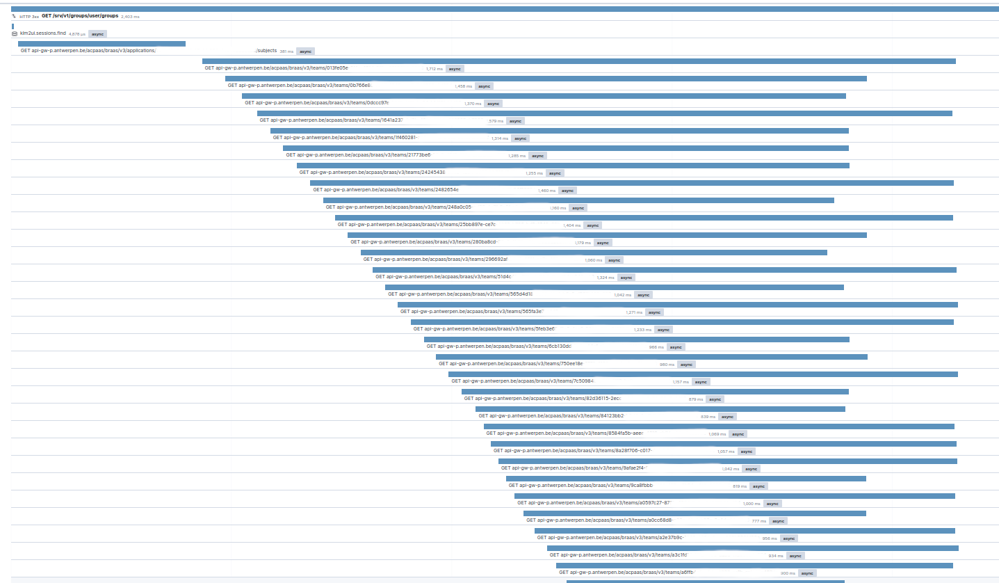
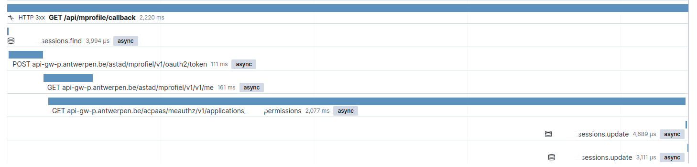
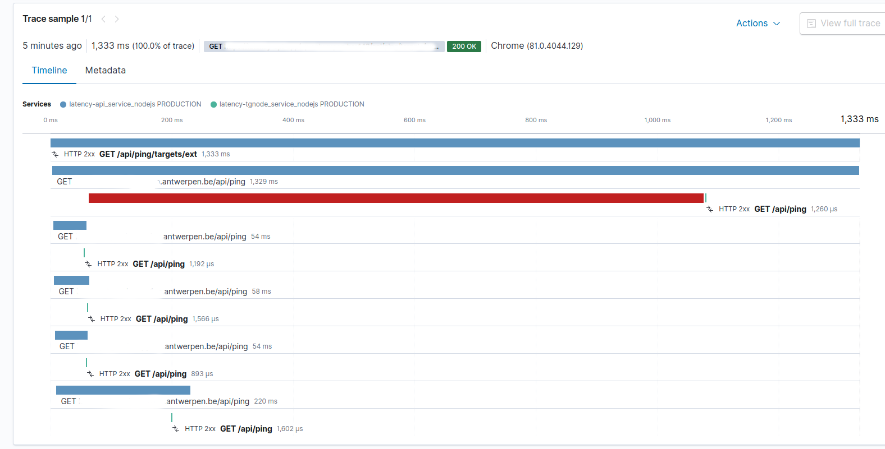
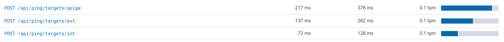

# Best practices Digipolis

**Doel:** Best practices en lessons learned uit de praktijk delen in de organisatie.

**Doelgroep:** developers van projectteams, business architecten en applicatiearchitecten.

**Communitywerking:** Voeg gerust nieuwe best practices toe middels een pull request.


*In de titels wordt aangegeven welk onderdeel must do/verplicht (V) of should do/optioneel (O) is.*

# Inhoudstabel
<!-- generated with doctoc (https://www.npmjs.com/package/doctoc) -->
<!-- START doctoc generated TOC please keep comment here to allow auto update -->
<!-- DON'T EDIT THIS SECTION, INSTEAD RE-RUN doctoc TO UPDATE -->

- [Document historiek](#document-historiek)
- [Stappenplan](#stappenplan)
- [Tools](#tools)
  - [Gebruik het Splunk Dashboard voor HTTP troubleshooting (V)](#gebruik-het-splunk-dashboard-voor-http-troubleshooting-v)
  - [Gebruik het Kibana Dashboard voor applicatie log troubleshooting (V)](#gebruik-het-kibana-dashboard-voor-applicatie-log-troubleshooting-v)
  - [Gebruik het Status Dashboard voor uptime troubleshooting (V)](#gebruik-het-status-dashboard-voor-uptime-troubleshooting-v)
  - [Gebruik het CheckMk Dashboard voor VM troubleshooting (V)](#gebruik-het-checkmk-dashboard-voor-vm-troubleshooting-v)
  - [Gebruik het Sysdig Dashboard voor container troubleshooting (V)](#gebruik-het-sysdig-dashboard-voor-container-troubleshooting-v)
  - [Gebruik het APM  Dashboard voor performantie troubleshooting (O)](#gebruik-het-apm--dashboard-voor-performantie-troubleshooting-o)
- [Monitoring](#monitoring)
  - [Implementatie van health checks (V)](#implementatie-van-health-checks-v)
    - [Enkele tips bij het implementeren van health checks (O)](#enkele-tips-bij-het-implementeren-van-health-checks-o)
    - [Voorzie een HTTP response time mee in de logging (O)](#voorzie-een-http-response-time-mee-in-de-logging-o)
  - [Stel liveness en readiness probes in (V)](#stel-liveness-en-readiness-probes-in-v)
- [Logging](#logging)
  - [Kies bewust wat er wel en niet gelogd wordt (V)](#kies-bewust-wat-er-wel-en-niet-gelogd-wordt-v)
- [Applicatie](#applicatie)
  - [Upgrade naar de laatste versie van gebruikte technologieën (V)](#upgrade-naar-de-laatste-versie-van-gebruikte-technologie%C3%ABn-v)
  - [Overweeg het gebruik van toolboxen in applicaties (V)](#overweeg-het-gebruik-van-toolboxen-in-applicaties-v)
  - [Analyseer thread starvation (V)](#analyseer-thread-starvation-v)
  - [Maak gebruik van HTTP client factory in dotnet (V)](#maak-gebruik-van-http-client-factory-in-dotnet-v)
  - [Zorg voor continue execution door headers read (V)](#zorg-voor-continue-execution-door-headers-read-v)
  - [Vergroot de performantie bij serialiseren en deserialiseren (UTF8JSON) (O)](#vergroot-de-performantie-bij-serialiseren-en-deserialiseren-utf8json-o)
  - [Gebruik streams ivm memory en performantie (O)](#gebruik-streams-ivm-memory-en-performantie-o)
  - [Weeg de keus voor asynchrone werking af (O)](#weeg-de-keus-voor-asynchrone-werking-af-o)
  - [Bouw retry's in bij het aanspreken van onderliggende componenten (O)](#bouw-retrys-in-bij-het-aanspreken-van-onderliggende-componenten-o)
  - [Voorkom overbodige http calls (V)](#voorkom-overbodige-http-calls-v)
  - [Voorkom blobs in het datamodel (V)](#voorkom-blobs-in-het-datamodel-v)
  - [Laad data bij het opstarten van de applicatie ipv voor iedere request (O)](#laad-data-bij-het-opstarten-van-de-applicatie-ipv-voor-iedere-request-o)
  - [Voorkom dat de SPA dubbele calls doet naar de BFF/API (V)](#voorkom-dat-de-spa-dubbele-calls-doet-naar-de-bffapi-v)
  - [Verwerk de asynchrone berichten op andere infrastructuur dan de API (V)](#verwerk-de-asynchrone-berichten-op-andere-infrastructuur-dan-de-api-v)
  - [Maak gebruik object storage ipv digital assets (O)](#maak-gebruik-object-storage-ipv-digital-assets-o)
  - [Authz: gebruik authz api versie > v2 (V)](#authz-gebruik-authz-api-versie--v2-v)
  - [Voorkom memory leaks en voorzie gc indien nodig (V)](#voorkom-memory-leaks-en-voorzie-gc-indien-nodig-v)
  - [Implementeer SIGTERM events (V)](#implementeer-sigterm-events-v)
- [Database](#database)
  - [Berekenen van connection pool settings (V)](#berekenen-van-connection-pool-settings-v)
  - [Optimaliseer en beperk de database queries (V)](#optimaliseer-en-beperk-de-database-queries-v)
  - [Voorkom trage queries (V)](#voorkom-trage-queries-v)
    - [Een specifieke query is traag](#een-specifieke-query-is-traag)
    - [Alle queries zijn traag](#alle-queries-zijn-traag)
  - [Activeer database statistics (O)](#activeer-database-statistics-o)
- [CI/CD](#cicd)
  - [Code quality control (V)](#code-quality-control-v)
  - [Controleer de (technische) afspraken uit QG1 en 2 (V)](#controleer-de-technische-afspraken-uit-qg1-en-2-v)
  - [Problemen oplossen ontwikkelomgeving bij gebruik docker (O)](#problemen-oplossen-ontwikkelomgeving-bij-gebruik-docker-o)
- [Infrastructuur](#infrastructuur)
  - [Gebruik de aanbevolen docker images (O)](#gebruik-de-aanbevolen-docker-images-o)
  - [Netwerk latency](#netwerk-latency)
  - [Maak gebruik van interne DNS'en waar mogelijk (O)](#maak-gebruik-van-interne-dnsen-waar-mogelijk-o)
- [Nuttige links](#nuttige-links)

<!-- END doctoc generated TOC please keep comment here to allow auto update -->


# Document historiek

| Versie | Auteur          | Datum      | Opmerkingen                                                                       |
| ------ | --------------- | ---------- | --------------------------------------------------------------------------------- |
| 0.1    | Karlien Engelen | 06/03/2019 | Initial draft                                                                     |
| 1.0    | Karlien Engelen | 10/05/2019 | Toevoegen best practice 'connection pool settings', update versienr naar 1.x      |
| 1.1    | Karlien Engelen | 10/05/2019 | Toevoegen best practice 'Problemen oplossen ontwikkelomgeving bij gebruik docker' |
| 1.2    | Dries Droesbeke | 24/03/2021 | Toevoegen best practices ifv performantie                                         |
| ---    | ---             | ---        | ---                                                                               |
| ---    | ---             | ---        | ---                                                                               |
| ---    | ---             | ---        | ---                                                                               |
| ---    | ---             | ---        | ---                                                                               |


# Stappenplan


Welke stappen kan een developer / projectteam zelf zetten bij probleemanalyse? En wat verwacht de organisatie van een projectteam, voordat er een multidisciplinair team wordt samengesteld om een probleem breder te onderzoeken? 

Zie stappenplan: https://docs.google.com/document/d/1GBcZdBj-nMdlAyn2WYYomvmV2kjwNIkTCtPhwfEofzM/edit?usp=sharing 

Aandachtspunten bij troubleshooting: 
-   Infrastructuurtekening inclusief alle koppelingen 
-   Uittekenen van de flow van calls die het probleem veroorzaakt
-   Reproduceerbaar scenario


# Tools

Hieronder kan je een overzicht vinden van alle tools die beschikbaar zijn voor het projectteam om een probleem te analyseren.

De url's van deze tools kan je vinden op [deze WIKI](https://wiki.antwerpen.be/ACPAAS/index.php/Tools).


## Gebruik het Splunk Dashboard voor HTTP troubleshooting (V)


Dit dashboard stelt de ontwikkelaar in staat om alle HTTP-calls van hun applicatie te onderzoeken.

De belangrijkste metrics van een HTTP-call voor het bepalen van de gezondheid van een applicatie zijn de responstijden en de 50X-statuscodes. Het falen van een service gaat vaak gepaard met een 50X response code. De code geeft meer context over het falen.

Zie uitleg: https://wiki.antwerpen.be/Digipolis/index.php/Splunk_(Ontwikkelaars) 
en de presentatie die gegeven is op de Tech guild bijeenkomst van 21/3/2019: https://docs.google.com/presentation/d/17ahE8aA7iDEL8elM2WGknYA2AyDxBbgBz1VMrpS-r1I/edit?usp=sharing

De HAProxy HTTP logs komen sinds mei 2021 in Elastic terecht.

## Gebruik het Kibana Dashboard voor applicatie log troubleshooting (V)

Alle stdout logs van de Digipolis container infrastructuur komen automatisch terecht in Elastic. Via een Kibana dashboard kan je filteren op jouw project en/of container waardoor je op een eenvoudige manier toegang hebt tot alle container logs.

Ook kan je de logs eenvoudig filteren op keywords of er gestructureerd in zoeken indien je JSON logt naar stdout.

## Gebruik het Status Dashboard voor uptime troubleshooting (V)

Op het status dashboard van Antwerpen krijg je een overzicht van alle applicaties of API's waarvoor er healthchecks zijn opgezet. 

Dit dashboard bevat honderden uptime checks en is vooral interessant om te achterhalen of een bepaalde service niet beschikbaar is omwille van een outage.

## Gebruik het CheckMk Dashboard voor VM troubleshooting (V)

Via CheckMk kan je een overzicht krijgen op de Digipolis infrastructuur. Deze tool is voornamelijk interessant als je meer inzicht wil krijgen op de VM infrastructuur.

Ook kan je er meer detail vinden over de "health" checks die gebruikt worden op het status dashboard en de PostgreSQL database (servers).


## Gebruik het Sysdig Dashboard voor container troubleshooting (V)

Via Sysdig kan je meer inzicht krijgen op de containers die gehost zijn op de Digipolis container infrastructuur.

Hier kan je bijvoorbeeld netwerk connectiviteit, cpu/ram etc opvolgen voor een container of een node.


## Gebruik het APM  Dashboard voor performantie troubleshooting (O)


Een APM tool is een van de betere oplossingen om performantie problemen te analyseren. Als er APM instrumentation voorzien is in de verschillende componenten krijgt men een heel duidelijk visueel overzicht van de flow die er binnen een bepaald proces plaatsvindt.

Problemen die je via APM eenvoudig kan detecteren:
* trage queries of http requests
* aantal queries of http calls die een bepaalde component doet binnen 1 process
* geen optimale code zoals zaken afhandelen in loops etc
* cpu belasting van het systeem (gaps tussen apm items)

Op deze manier kan je dan vrij snel bepalen of een bepaalde query traag is, dat de logica niet optimaal geschreven is of indien de latency veroorzaakt wordt door de infrastruur. 

Meer informatie over APM kan je [hier](https://github.com/digipolisantwerpdocumentation/application-performance-monitoring) vinden.


# Monitoring


## Implementatie van health checks (V)

Health checks zorgen ervoor dat het projectteam of P&I kan ingrijpen als er iets met de applicatie of service aan de hand is. Alerting gebeurt via een dashboard en via e-mailnotificaties. 

Momenteel wordt er voor de dashboarding en alerting gebruik gemaakt van Check_Mk en (binnenkort) van de nieuwe status API (= het continuous monitoring platform).

Voor de implementatie van de health checks is er een nieuwe standaard in de maak die beter aansluit op het gebruik van liveness en readiness probes. De (work in progress) informatie vind je hier: https://github.com/digipolisantwerpdocumentation/status-monitoring 

### Enkele tips bij het implementeren van health checks (O)

-   Zet de juiste beveiliging op de endpoints (ze moeten snel uitgevoerd kunnen worden)

-   Bedenk bij het opstellen van het components endpoint (voorheen 'monitoring' endpoint) goed welke onderliggende componenten echt kritisch zijn voor het functioneren van je applicatie en welke niet (bijvoorbeeld: de logging engine is niet kritisch, maar de database wel). En bepaal op basis daarvan of je  endpoint op OK, degraded of outage (of in de oude versie: OK, WARN, CRIT) komt te staan. 

-   Vraag in de components (monitoring) call de status van onderliggende services op via de status API (het continuous monitoring systeem) in plaats van zelf nog een extra call te doen naar de betreffende service. Je hoeft op die manier in je components call dus geen status of monitoring endpoints meer te bevragen. Dit zorgt voor een snellere afhandeling en voorkomt circular calls die alles vertragen en uiteindelijk timeouts zouden kunnen geven. 

### Voorzie een HTTP response time mee in de logging (O)

Logging (via middleware) van alle inkomende requests en afgeronde requests (en bijbehorende timings) is geen overbodige luxe in een micro-service-omgeving. Ook het gebruik van een correlationId die doorgesluisd wordt doorheen inner calls naar andere API’s is een must om het verhaal van een call die van een afnemer komt, volledig te analyseren. 

Het is een aanrader voor elke applicatie binnen Digipolis. 

Zie voor een ASP .NET CORE voorbeeld van een project: https://bitbucket.antwerpen.be/projects/GDP/repos/gdp_common_aspnetcore/browse/src/GdpCommon/Logging/RequestLogMiddleware.cs

## Stel liveness en readiness probes in (V)

Op alle toepassingen die in openshift draaien, kunnen liveness en readiness probes gedefinieerd worden.

Een liveness probe gaat na of de container nog actief is. Als de liveness probe faalt dan wordt de pod/container herstart.
Een readiness probe controleert of de app/service in container requests kan verwerken. Faalt de readiness probe dan worden er geen requests meer naar deze pod/container gestuurd.

Zie uitleg: https://bitbucket.antwerpen.be/projects/PLAT/repos/documentation/browse/Docker.md#probes


# Logging


## Kies bewust wat er wel en niet gelogd wordt (V)

Als er gebruik gemaakt wordt van standaard loginstellingen, wordt zowat alles gelogd. Het is beter om werk te steken in het granulair kunnen aansturen van logging niveaus. Doe je dit niet, dan mis je de flexibiliteit om eigen logs op niveau “Information” te loggen en andere logs vanaf “Error”. Dit bemoeilijkt het doorzoeken van logs op het moment dat er een probleem optreedt. 

Geef ook zeker correlationId’s mee in je logging, dit vergemakkelijkt troubleshooting over diverse flows heen.

Uitleg over hoe je het best de loglevels instelt, incl verwijzingen naar voorbeeldcode, vind je hier: https://docs.google.com/document/d/1tnK8JuM8RoK_3JlAKHaCvyySY4a6zNdhZcs9IIOcfQs/edit 
*Vul deze best practice gerust aan met je eigen ervaringen*


# Applicatie
## Upgrade naar de laatste versie van gebruikte technologieën (V)

Als er van technologieën een nieuwe versie wordt uitgebracht, bevat deze vaak verbeteringen in het kader van security, performantie, bugfixes etc. Het is daarom aangeraden zo snel mogelijk (na voldoende te testen) te upgraden naar de laatste versies. 
Zolang de frameworks nog van security updates worden voorzien, is het geen absolute must om te upgraden. 

Voor ASP .NET Core applicaties is het bijvoorbeeld heel relevant om zo snel mogelijk te upgraden naar de laatste versies van .net core (momenteel 5.0).

## Overweeg het gebruik van toolboxen in applicaties (V)

Er zijn diverse toolboxen beschikbaar via https://github.com/digipolisantwerp 
Het gebruik van toolboxen heeft voor- en nadelen. Het voordeel is dat er voor de ontwikkeling van een applicatie minder tijd moet gestoken worden in het aanmaken van code die regelmatig terugkeert (boilerplate code). 
Het nadeel is dat als een toolbox outdated is of een fout bevat, deze zich ook bevindt in elke applicatie die daarvan gebruik maakt. Ook is het nadeel dat het customizen van code binnen een toolbox vaak moeilijk is. 
Daarom raden we aan om bij het gebruik van een toolbox grondig na te denken over hoe deze zo nuttig mogelijk aan te wenden. Wat eventueel kan helpen is om de toolboxen te ‘forken’, zelf kleine aanpassingen te maken indien nodig en de verbeteringen vervolgens terug te geven aan de community.
*Todo: review doen van de bestaande toolboxen + toolboxen aanbieden in nodejs (nu zijn deze vooral in .net beschikbaar)*

## Analyseer thread starvation (V)

Je wil voorkomen dat er code is die mogelijks [thread starvation](https://en.wikipedia.org/wiki/Starvation_(computer_science)) kan veroorzaken. Er zijn tools om dit voor jouw applicatie te onderzoeken. 

Om .NET code te analyseren op die mogelijke thread starvation kan gebruik gemaakt worden van een handige nuget package: https://github.com/benaadams/Ben.BlockingDetector Voer dan alle calls uit op een lokale machine en analyseer de output op mogelijke verbeteringen. Pas de verbeteringen toe. 
Met deze analyse is bij sommige projecten bijvoorbeeld aan het licht gekomen dat het loggen van events nog blocking werd uitgevoerd.

Een bron voor diagnose van thread starvation in PRD: https://blogs.msdn.microsoft.com/vancem/2018/10/16/diagnosing-net-core-threadpool-starvation-with-perfview-why-my-service-is-not-saturating-all-cores-or-seems-to-stall/ 


## Maak gebruik van HTTP client factory in dotnet (V)

De lifecycle van een httpclient is vrij complex. Je kan een httpClient als singleton gebruiken zodat je deze niet telkens hoeft op te bouwen, MAAR dit wil ook zeggen dat bij DNS-wijziging van de achterliggende service, de HTTP-client dit niet zal detecteren en zal blijven falen tot de service is herstart. Het telkens opbouwen en afbreken van HttpClient is ook nefast aangezien het disposen van HTTPClients kan betekenen dat de onderliggende connectie gedurende een aantal seconden nog wordt vastgehouden voor deze wordt vrijgegegeven om opnieuw te gebruiken. De betere en standaard manier om HTTPClient te configureren en te gebruiken is via de HttpClientFactory die vanaf ASP .NET Core versie 2.1 beschikbaar is.
https://docs.microsoft.com/en-us/dotnet/standard/microservices-architecture/implement-resilient-applications/use-httpclientfactory-to-implement-resilient-http-requests 
Leuk hierbij is dat je typed clients kan maken die gevuld kunnen worden met hun eigen HttpMessageHandlers en configuratie en die eenvoudigweg geïnjecteerd kunnen worden. De lifecycle van de agents waar de HttpClient geïnjecteerd wordt is dan altijd transient! 
Voorbeeld: https://bitbucket.antwerpen.be/projects/GDP/repos/bijlage_api_aspnetcore/browse/src/Digipolis.ABS.Bijlage.API/DependencyRegistration.cs 

## Zorg voor continue execution door headers read (V)

In .NET kun je kiezen om te wachten tot een volledige response van een HTTP-call is uitgelezen of je kan kiezen om als de headers (die eerst binnenkomen) gelezen zijn, reeds verder te gaan in de executie van de code. Dit versnelt de code aanzienlijk in het geval de content van een response niet uitgelezen dient te worden bij bijvoorbeeld een foutieve statuscode (die in een header zit).


## Vergroot de performantie bij serialiseren en deserialiseren (UTF8JSON) (O)

Als je applicatie veel gaat serialiseren en deserialiseren is het noodzakelijk dat het beste, het meest performante en meest efficiënte qua memory-consumption wordt gekozen. Hierbij is bijvoorbeeld gekeken naar Utf8Json. Zie: https://github.com/neuecc/Utf8Json

*Serialisatie = het zodanig omzetten van een object dat dit geschikt wordt voor verzending of opslag op een sequentieel medium*

## Gebruik streams ivm memory en performantie (O)

Door gebruik te maken van disposable streams bij het opstellen van de request en het uitlezen van de response, garandeer je dat de memory consumption niet dramatisch verhoogt bij vele gelijktijdige requests. Ook de globale performantie is beter.

*In computer science, a stream is a sequence of data elements made available over time. A stream can be thought of as items on a conveyor belt being processed one at a time rather than in large batches.*

## Weeg de keus voor asynchrone werking af (O)

Een asynchrone werking zorgt ervoor dat er vanuit de aanroepende toepassing niet gewacht moet worden tot de uitvoering van de call klaar is (wat kan leiden tot een slechte user experience en mogelijk zelfs een time-out in de applicatie) maar dat de applicatie op de hoogte wordt gebracht zodra het antwoord gereed is. Voor onvermijdelijk langlopende API calls kan je best een asynchrone API aanbieden, door ontsluiting via events of door het gebruik van het HTTP 202 patroon. 

Bij het ontwikkelen van API’s is het belangrijk om de interne logica hiervan async op te stellen (ivm thread starvation en throughput). Zo kan je meer requests per seconde aan door slapende threads te hergebruiken voor nieuwe binnenkomende requests. 

Bij het aanspreken van een API vanuit je applicatie maak je best een bewuste afweging om wel of niet een (a)synchrone request te sturen en de user interface wel of niet te blokkeren tijdens de verwerking. Als er een kans is dat de verwerking van de request niet altijd onmiddellijk zal worden voltooid, is de asynchrone werking aangeraden. Maar deze brengt wel een extra complexiteit mee in de applicatie.

## Bouw retry's in bij het aanspreken van onderliggende componenten (O)

Maakt je applicatie gebruik van andere componenten, zorg dan indien mogelijk dat er retry’s zijn ingebouwd. Als je in je applicatie een 502 of 503 terugkrijgt, zou je best automatisch een retry van de call doen.

Hou er ook rekening mee dat een service kan beschermd worden met **rate-limit** functionaliteit. De service (en/of API gateway) zal **HTTP response code 429** teruggeven als de rate-limit grens is bereikt.

Onze API gateway geeft 2 HTTP headers terug indien rate-limit actief is :
- **X-RateLimit-Limit-minute** : het maximum aantal requests (in dit geval per minuut)
- **X-RateLimit-Remaining-minute** : het aantal nog mogelijke requests (in dit geval per minuut)

*To do: de uitwerking hiervan verder bekijken: Vragen we alle applicaties om dit zelf in te bouwen, of kan hiervoor een handreiking gedaan worden zoals een toolbox maken, het op gatewayniveau oplossen, tools aanbieden die dit probleem oplossen en integreren met de bestaande infrastructuur (zoals http://www.thepollyproject.org)?*


## Voorkom overbodige http calls (V)

Beperk het aantal http calls aangezien deze veel overhead geven in de afhandeling van de request. In onderstaande APM screenshot kan je zien dat er eerst een call gebeurt om een lijst op te halen waarvoor er dan voor ieder item een nieuwe call gebeurt om de detail op te halen.

In dit scenario zou het interessanter zijn om slechts enkele http requests te doen die meerdere id's bevatten.




## Voorkom blobs in het datamodel (V)

Bewaar de attachments van bijvoorbeeld een dossier nooit in het database model van het dossier zelf maar bewaar er een referentie naar de bron. Bij voorkeur worden de binaire files zelf een object storage(ceph/cloudian/s3) of de assets engine bewaard.

Zo voorkom je bij CRUD operaties dat de binaire data voor vertraging gaat zorgen. Vaak worden er ook revisies bijgehouden van de entiteiten waardoor er wel wat diskspace verloren gaat aan duplicaten van deze attachments.

## Laad data bij het opstarten van de applicatie ipv voor iedere request (O)

Het komt vaak voor dat er in de verwerking van een API request data wordt opgehaald (query/http) die voor iedere request hetzelfde is. Hierbij is het aangewezen om deze data te cachen of in te laden bij het opstarten van de applicatie.

## Voorkom dat de SPA dubbele calls doet naar de BFF/API (V)

Bij verschillende projecten hebben we gemerkt dat er onbewust meerdere calls vanuit de SPA vertrekken om dezelfde data op te halen.

Hiervoor waren er voornamelijk 2 oorzaken:

* Er werd niet gewerkt met een "state store" waardoor iedere component de data opnieuw ging ophalen
* In de component werd er niet nauwkeurig omgesprongen met http calls waardoor er onbewust meerdere identieke calls naar de backend vertrokken. Dit is vaak te wijten aan het rerenderen van een component door niet relevante state changes.


## Verwerk de asynchrone berichten op andere infrastructuur dan de API (V)

Indien je sommige taken uit een API request verplaatst naar een achterliggende (async) verwerking is het aangewezen om deze jobs niet af te handelen in dezelfde runtime/container als de API zelf.

Hiervoor kan je:
* Een apart project opzetten om deze jobs/events af te handelen.
* In het project een extra console applicatie voorzien die de afhandendeling van de jobs op zich neemt. In de AppConfig configuratie kan je het commando om deze console applicatie uit te voeren dan ingeven onder de "worker" configuratie. Deze opzet zorgt ervoor dat tijdens de deployment er 2 API containers gedeployed worden(default) en 1 extra worker container. 

Om berichten tussen de api en de worker uit te wisselen kan er gebruik worden gemaakt van Kafka.

## Maak gebruik object storage ipv digital assets (O)
 
Indien de applicatie intensief gebruik maakt van assets kan het interessanter zijn om de bestanden op een s3-compatible object storage(ceph/cloudian) te bewaren.

Een voordeel van deze opzet kan ook zijn dat, indien er geen ACL van toepassing is, deze assets ook rechtstreeks ontsloten kunnen worden vanuit de S3 bucket waardoor de applicatie zelf ontlast wordt.

## Authz: gebruik authz api versie > v2 (V)

De Authz v1 services draaien op deprecated infrastructuur. In verschillende taskforces is naar boven gekomen dat de responsetijden van de Authz v2 service (of hoger) ~x5 sneller zijn dan deze voor versie Authz v1.




## Voorkom memory leaks en voorzie gc indien nodig (V)

Bij sommige projecten zien we onderstaand memory patroon. Het geheugen loopt op tot de limiet die is ingesteld voor de container en deze container wordt dan automatisch herstart.


Dit kan voorkomen worden door geen memory leaks te schrijven :)
* Ga nauwkeurig om met data die je in het geheugen bewaart zonder deze te deleten/expiren (bv cache)
* Als de toepassing veel data moet verwerken is het aangewezen om deze "in meerdere kleine stappen" te verwerken of te opteren voor een asynchrone verwerking.
* Zorg ervoor dat garbage collection actief is en optimaal geconfigureerd is.

## Implementeer SIGTERM events (V)

Zorg ervoor dat uw applicatie om kan met SIGTERM events. Wanneer het container platform beslist om de container te stoppen is het aangewezen om de processen die lopen (background, http) eerst af te ronden in plaats van de container abrubt te stoppen.

Deze aanpak zorgt ervoor dat de API requests nog worden afgehandeld of dat er geen inconsistenties ontstaan indien de verwerking van een background job niet idempotent is.

In onderstaand voorbeeld worden de background processen graceful afgesloten alvorens de webserver af te sluiten.

```javascript
const server = app.listen(3000, () => console.log('Example app listening on port 3000!'));

process.on('SIGTERM', () => {
  console.info('SIGTERM signal received.');
  console.log('Closing http server.');

  workers.finish();

  server.close(() => {
    console.log('Http server closed.');
  });
});
```


# Database
## Berekenen van connection pool settings (V)

Wanneer `Maximum Pool Size` niet ingesteld wordt, zullen database operaties bij piekgebruik van de toepassing niet gequeued worden en zal de toepassing meer connecties proberen te openen dan mogelijk. Zodra je meer connecties probeert te maken dan toegelaten krijg je een fout. Door het gebruik van de connectionpool kun je zorgen voor een slimmer gebruik van het maximaal aantal toegelaten database connections. 

Een uitgebreide uitleg en werkwijze vind je hier: https://github.com/digipolisantwerpdocumentation/best-practices/blob/master/CalculateConnectionPoolSettings.md


## Optimaliseer en beperk de database queries (V)

Hoewel databanken ontworpen zijn om snel en performante data te kunnen opvragen is het toch altijd aangewezen om deze zo min mogelijk te belasten.

* Beperk het aantal rijen dat er by default wordt teruggegeven. In onderstaand voorbeeld werden er 500 records opgehaald terwijl er maar max 50 getoond werden. In de praktijk werd er voor ieder API call +3MB naar de frontend verzonden en werden er 450 items in de browser verwerkt die niet gebruikt werden.
* Beperk het aantal queries. Vaak zijn er applicaties die enorm veel kleine/snelle queries doen die onder load wel eens problemen kunnen geven.
* Optimaliseer de queries zodat deze zo performant mogelijk geschreven zijn. Analyseer hiervoor "het query plan". 
* Voornamelijk bij grote volatiele datasets met complexe queries/joins kan het interessant zijn om delen van de data vanuit de applicatie apart op te halen en te cachen.
* Als de trage queries veroorzaakt worden door de hoeveelheid aan data kan er ook voor gekozen worden om de oudere data te archiveren of een vorm van sharding te voorzien.


##  Voorkom trage queries (V)

### Een specifieke query is traag

Indien 1 query consistent traag is komt dit waarschijnlijk doordat:

* er geen (correcte) indexen op de database aanwezig zijn
* de query niet optimaal geschreven is (ORM?)
* het datamodel té genormaliseerd is
* er te veel data is waarbij het interessant is om oude data te archiveren of een vorm van sharding te voorzien

Via een EXPLAIN query kan je het query plan analyseren om zo de bottleneck te vinden.


### Alle queries zijn traag

Wanneer alle queries traag zijn is dit vermoedelijk te wijten aan de database/netwerk infrastructuur.


Indien dit fenomeen zich voordoet kan je via CheckMK de details van de database server opvragen. 

Zoals je in onderstaande grafiek kan zien zijn er "CPU load" spikes die hoger zijn dan 6 terwijl de server zelf maar 6 cpu's heeft. Zulke spikes kunnen plaatsvinden wanneer de database gelocked wordt tijdens een backup(op recente db versies niet meer van toepassing) of wanneer er bijvoorbeeld veel load is op een gedeelde db infrastructuur.


## Activeer database statistics (O)

Wanneer je meer inzicht wenst op alle queries die gebeuren op de database kan je, afhankelijk van de database, statistics activeren.

Hierbij krijg je dan een overzicht van alle queries die er gebeuren met de gemiddelde en max response tijden.


# CI/CD
## Code quality control (V)

Software quality control omvat een geheel aan methodieken om de kwaliteit van de code te bewaken. 
Via het Smartops lab wordt bekeken hoe we de code quality control kunnen automatiseren en standaard meenemen in het ontwikkelproces. Intussen is het aangewezen om hiervoor in je projectteam aandacht voor te hebben, zowel bij eigen ontwikkeling als ontwikkeling door de leverancier van een challenge. 
Zorg voor code reviews door ontwikkelaars of applicatie-architecten, doe eens aan pair programming, zorg voor code die herbruikbaar is voor andere projecten, etc.

## Controleer de (technische) afspraken uit QG1 en 2 (V)

Controleer tijdens de projectuitvoer samen met de leverancier eens of er voldaan wordt aan de [technische specificaties](https://github.com/digipolisantwerpdocumentation/technische_specificaties) die in de offertevraag zijn meegegeven, en aan de technische afspraken die zijn vastgelegd op het project-trellokaartje in [Quality Gate 2](https://trello.com/b/limU7MkC/quality-gates-20), bijvoorbeeld de architecturale opzet en de Ops criteria zoals zero downtime deployment, monitoring etc.

## Problemen oplossen ontwikkelomgeving bij gebruik docker (O)

Af en toe gebeurt het dat ontwikkelaars met een actief docker netwerk op hun computer problemen ondervinden om bepaalde websites of systemen te raadplegen. De oplossing hiervoor vind je op https://wiki.antwerpen.be/Digipolis/index.php/Problemen_ontwikkelomgeving_bij_gebruik_van_docker 


# Infrastructuur
## Gebruik de aanbevolen docker images (O)

-   Gebruik zeker geen Alpine (ivm DNS issues), wel Debian
-   Gebruik bij voorkeur Red Hat images (ivm support) - Digipolis heeft daar intern nog weinig ervaring mee, maar zou die ervaring graag opbouwen

Bij vragen of twijfel overleg je met het ALM team. 

## Netwerk latency


In onderstaande demo toepassing zie je dat er verschillende "http ping" requests vertrekken naar een andere service. Bij de eerste request zie je dat enorm veel tijd verloren gaat(rode balk) alvorens de request aankomt op de 2de service.

Wanneer onderstaand fenomeen zich voordoet is dit waarschijnlijk te wijten aan het netwerk.



## Maak gebruik van interne DNS'en waar mogelijk (O)

In onderstaande afbeelding krijg je een overzicht van de gemiddelde responsetijden voor het oproepen van eenzelfde "http ping" service.

* apigw: api gateway -> api-gw-p.antwerpen.be
* ext: via de externe dns -> naam-app*-*.antwerpen.be
* int: over het interne kubernetes netwerk -> containername:port

Indien je gebruik maakt van een microservice architectuur is het aangewezen om de "int" DNS'en te gebruiken voor de interne communicatie tussen de componenten.



Ondertussen zijn er al tal van verbeteringen toegepast waardoor deze responsetijden in het algemeen lager zijn.


# Nuttige links

Informatie over ACPaaS engines, API's en toepassingen vind je op onderstaande plaatsen: 

API store: https://api-store.antwerpen.be/ -> API documentatie van alle Digipolis API's

Github: https://github.com/digipolisantwerp -> technische specificaties, API requirements API design and patterns etc. 

ACPaaS portaal: https://acpaas.digipolis.be -> Businessdocumentatie over ACPaaS componenten

ACPaaS wiki: https://wiki.digipolis.be/ACPAAS/ -> Onderhoudsdocumentatie over ACPaaS componenten

ITvanAtotZ wiki: https://wiki.digipolis.be/itvanatotz -> Functionele en technische documentatie over toepassingen

Bitbucket: Technische documentatie van diverse projecten en [ALM documentatie (over docker, bamboo, deploys etc.)](https://bitbucket.antwerpen.be/projects/PLAT/repos/documentation/browse)


