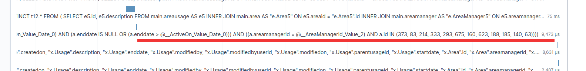
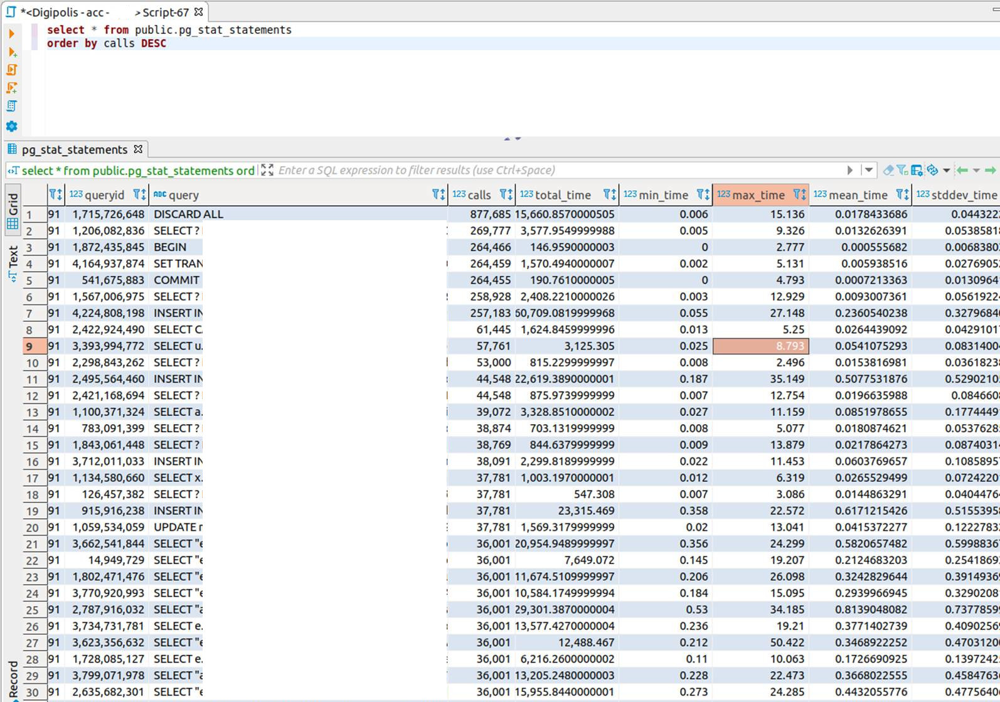

# Best practices Digipolis

**Doel:** Best practices en lessons learned uit de praktijk delen in de organisatie.

**Doelgroep:** developers van projectteams, business architecten en applicatiearchitecten.

**Communitywerking:** Voeg gerust nieuwe best practices toe middels een pull request.

# Inhoudstabel
<!-- generated with doctoc (https://www.npmjs.com/package/doctoc) -->
<!-- START doctoc generated TOC please keep comment here to allow auto update -->
<!-- DON'T EDIT THIS SECTION, INSTEAD RE-RUN doctoc TO UPDATE -->

- [Best practices Digipolis](#best-practices-digipolis)
- [Inhoudstabel](#inhoudstabel)
- [Document historiek](#document-historiek)
- [Tools](#tools)
- [Performance best practices](#performance-best-practices)
  - [Applicatie (V)](#applicatie-v)
    - [Less > more](#less--more)
    - [Optimize/reduce db queries](#optimizereduce-db-queries)
    - [Prevent loops](#prevent-loops)
    - [Async / queue](#async--queue)
    - [No base 64 attachments in entity & history …](#no-base-64-attachments-in-entity--history-)
    - [Load data on initialization](#load-data-on-initialization)
    - [Only fetch data once in BFF frontend](#only-fetch-data-once-in-bff-frontend)
    - [paging en archiving toevoegen](#paging-en-archiving-toevoegen)
    - [Enkel ophalen wat nodig is](#enkel-ophalen-wat-nodig-is)
    - [async tasks in sync architecture](#async-tasks-in-sync-architecture)
    - [Ceph ipv digital assets](#ceph-ipv-digital-assets)
    - [Auhtz v1](#auhtz-v1)
    - [memory leaks](#memory-leaks)
  - [Database (V)](#database-v)
    - [slow query](#slow-query)
    - [indexes(!)](#indexes)
    - [Optimize/reduce db queries](#optimizereduce-db-queries-1)
    - [(distributed) cache](#distributed-cache)
    - [Db backups comvault](#db-backups-comvault)
    - [db connecties in lijn zetten met aantal gebruikte pods](#db-connecties-in-lijn-zetten-met-aantal-gebruikte-pods)
    - [pgstats](#pgstats)
  - [Network (V)](#network-v)
    - [Separate environments (haproxy)](#separate-environments-haproxy)
    - [Internal communication vs ext vs apigw](#internal-communication-vs-ext-vs-apigw)
    - [Redhat latency](#redhat-latency)

<!-- END doctoc generated TOC please keep comment here to allow auto update -->

# Document historiek

| Versie | Auteur          | Datum      | Opmerkingen   |
| ------ | --------------- | ---------- | ------------- |
| 0.1    | Dries Droesbeke | 23/02/2021 | Initial draft |
| ---    | ---             | ---        | ---           |
| ---    | ---             | ---        | ---           |
| ---    | ---             | ---        | ---           |
| ---    | ---             | ---        | ---           |
| ---    | ---             | ---        | ---           |

# Tools

* CheckMK: http://checkmonitor.antwerpen.be/sst
* ECE APM: https://c1e1b93ef8c84abb95bd76158f0fa25b.elastic.antwerpen.be:9243/app/apm
* Splunk: https://splk-sh-01-00.antwerpen.be:8000/
* Sysdig: https://app.sysdigcloud.com/

# Performance best practices

## Applicatie (V)

### Less > more
### Optimize/reduce db queries

### Prevent loops

### Async / queue
### No base 64 attachments in entity & history …
### Load data on initialization
### Only fetch data once in BFF frontend
### paging en archiving toevoegen

### Enkel ophalen wat nodig is

### async tasks in sync architecture
 

### Ceph ipv digital assets

### Auhtz v1

### memory leaks

## Database (V)

###  slow query

###  indexes(!)
Dit dashboard stelt de ontwikkelaar in staat om alle HTTP-calls van hun applicatie te onderzoeken.

### Optimize/reduce db queries
### (distributed) cache
### Db backups comvault
### db connecties in lijn zetten met aantal gebruikte pods

### pgstats

## Network (V)

### Separate environments (haproxy)

### Internal communication vs ext vs apigw

### Redhat latency

